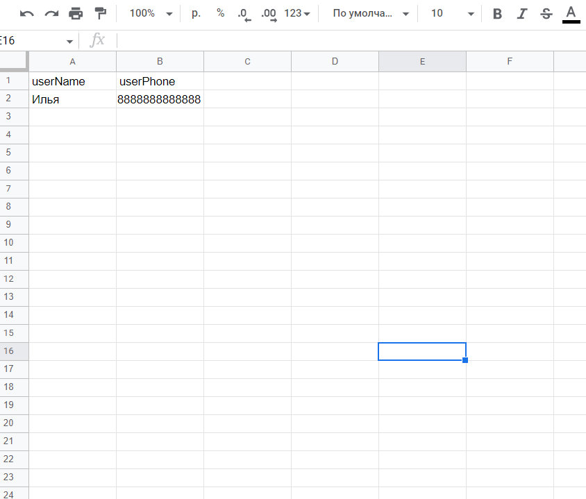

# botCourses
Это бот, который продает курсы по обучению финансовой грамотности у подписчиков группы
1. Сделан при помощи node-vk-bot-api и google api (googleapis@39)
2. Данный бот приветствует пользователя, отправляет пользователю полезную информацию
3. Реализованы кнопки, чтобы пользователь выбирал ответы
4. Даллее бот спрашивает у пользователя телефон и имя, чтобы отправить данные  в google таблицу
5. Проверка телефона выполнена  регулярным выражением

